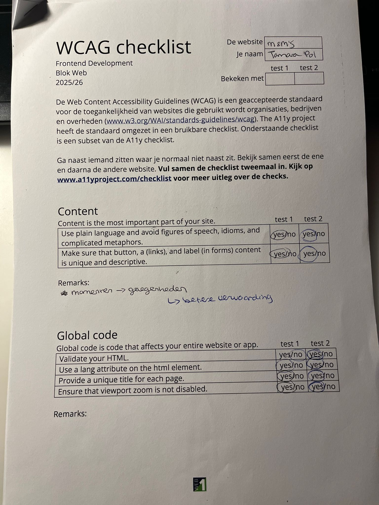
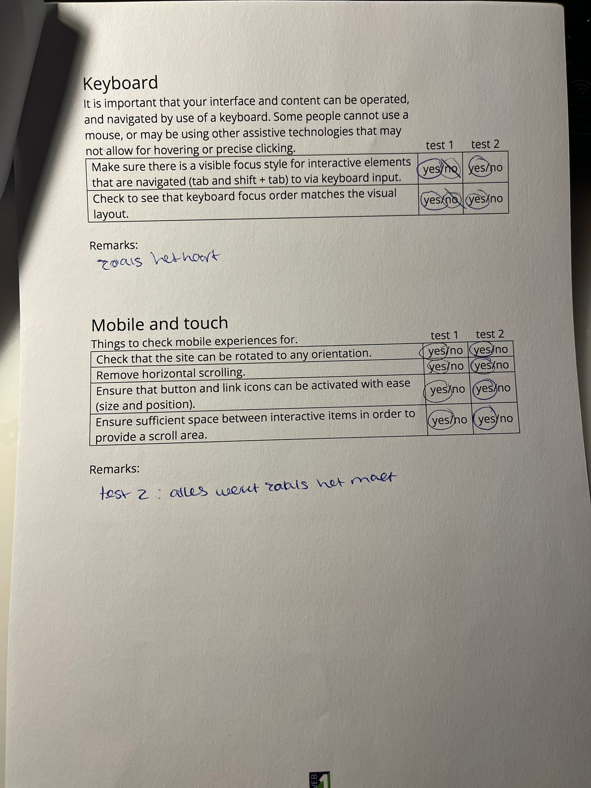
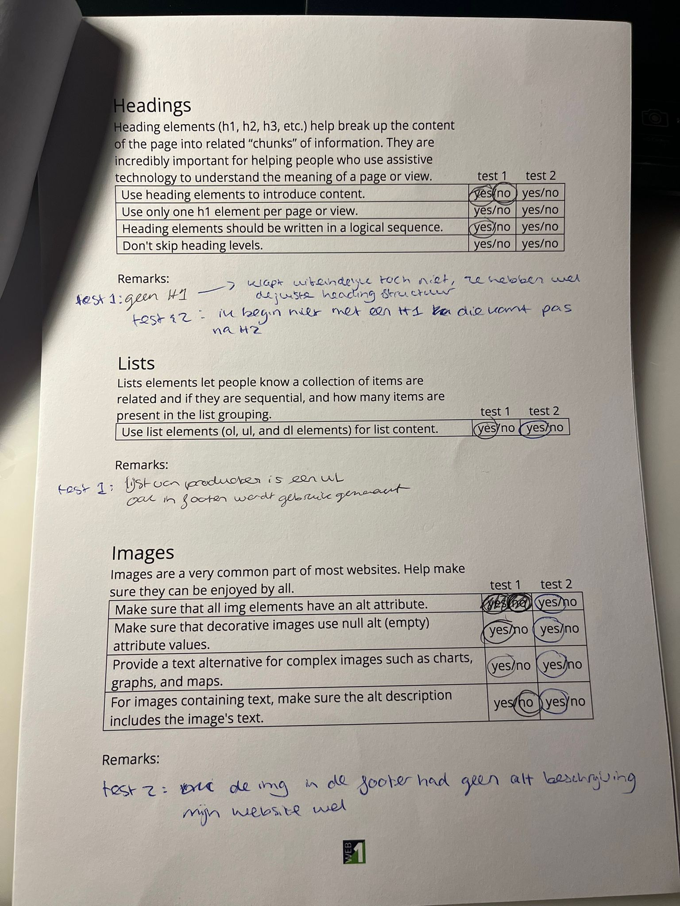
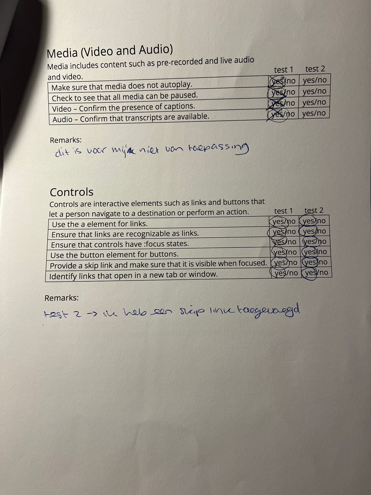
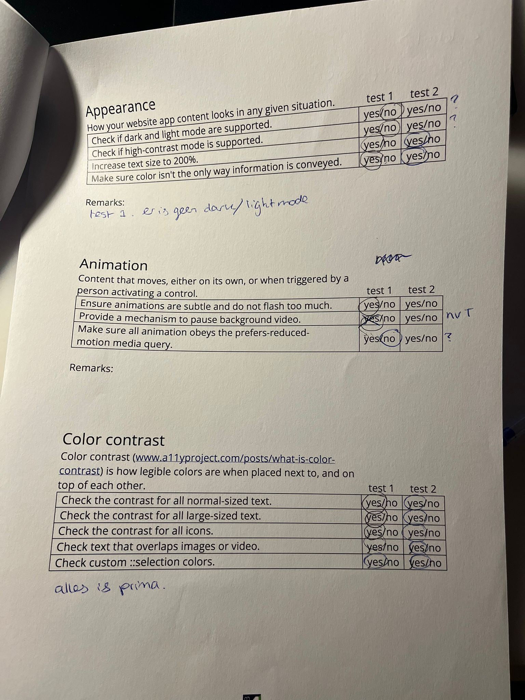
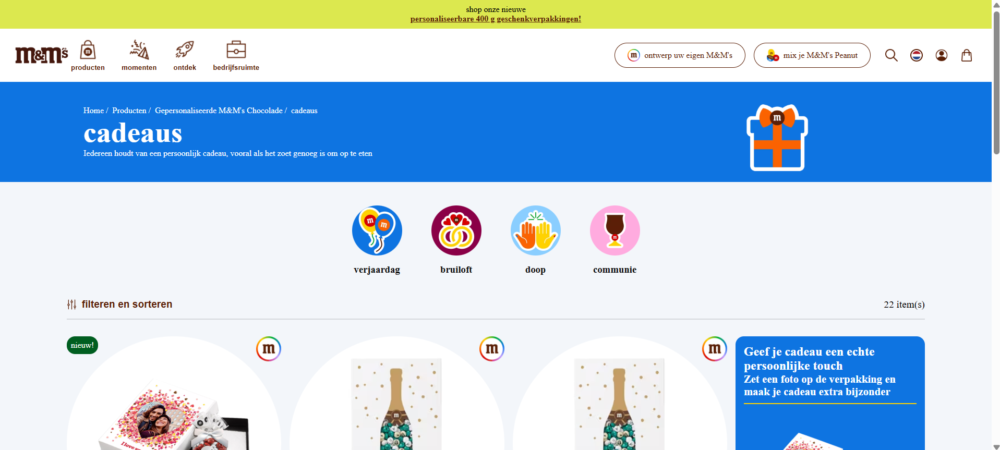

# Procesverslag
Markdown is een simpele manier om HTML te schrijven.  
Markdown cheat cheet: [Hulp bij het schrijven van Markdown](https://github.com/adam-p/markdown-here/wiki/Markdown-Cheatsheet).

Nb. De standaardstructuur en de spartaanse opmaak van de README.md zijn helemaal prima. Het gaat om de inhoud van je procesverslag. Besteedt de tijd voor pracht en praal aan je website.

Nb. Door *open* toe te voegen aan een *details* element kun je deze standaard open zetten. Fijn om dat steeds voor de relevante stuk(ken) te doen.

## Jij

  
uitwerken voor kick-off werkgroep

  ### Auteur:
  Tamara Pol

  #### Je startniveau:
  Blauw

  #### Je focus:
  Responsive
 

## Je website

  
uitwerken voor kick-off werkgroep

  ### Je opdracht:
  link naar de website die je gaat namaken óf de naam/omschrijving van je eigen ontwerp

  #### Screenshot(s) van de eerste pagina (small screen): 
  hier de naam van de pagina  
  

  #### Screenshot(s) van de tweede pagina (small screen):
  hier de naam van de pagina  
  
 

## Toegankelijkheidstest 1/2 (week 1)

  
uitwerken na test in 2e werkgroep

  ### Bevindingen
  Lijst met je bevindingen die in de test naar voren kwamen:
  1. de onderlijning van linkjes in de footer hebben faalt de WCAG met een 1.45
  2. Ook bij de promotie om een doos te personaliseren is er een geel randje op een blauwe achtergrond. Dit faalt met een 2.76
  3. Er bestaat geen dark modus voor m&ms???
  4. Er is geen h1 op resultaten pagina, wel op detail pagina
  5. Tijdens h2 lezen wordt bij de producten 2 keer 'nieuw' gezegd
  6. de hoeveelheid gram wordt gezegd en daarna zeg het euro en dan het bedrag. Lijkt het net alsof de hoeveelheid gram de aantal euros is dat het product kost.
  7. is niet duidelijk dat de 'g' gram betekent
  8. Wordt alleen gebruikt gemaakt van h2
  9. Bij screenreader wordt heel de header wordt overgeslagen met de linkjes. Ook bij promotie en alle producten
  10. geen alt tekst bij het plaatje in de footer. alt zegt niet wat het plaatje zegt

## Breakdownschets (week 1)

  
uitwerken na afloop 3e werkgroep

  ### de hele pagina: 
  

  ### dynamisch deel (bijv menu): 
  

  ### wellicht nog een dynamisch deel (bijv filter): 
  

## Voortgang 1 (week 2)

  
uitwerken voor 1e voortgang

  ### Stand van zaken
  Ik heb moeite met bepalen wat een heading moet zijn en welke. Voor mij is nog onduidelijk hoe ik mijn header overzet in html aangezien er zoveel losse stukjes zijn.

  ### Agenda voor meeting
  samen met je groepje opstellen

  | Tamara         | Demi               | Julian       | student 4        |
  | de header      | ---                | ---          | ---              |
  | headings       | en dit             | en ik dit    | en dan ik dat    |
  | sjablonen      | dit als er tijd is | nog een punt | dit wil ik zeker |
  | wanneer nav    | ...                | ...          | ...              |

  ### Verslag van meeting
  hier na afloop snel de uitkomsten van de meeting vastleggen

  - Uitleg gekregen over hoe ik mijn header kan doen, en hamburger menu
  - Opmaak van document
  - Over sjablonen bij de img alt tags gebruiken maar ook een h met visually hidden
  - Ik weet nu hoe en wanneer ik de detail element kan gebruiken

## Voortgang 2 (week 3)

  
uitwerken voor 2e voortgang

  ### Stand van zaken
  Ik ben al een eind opgeschoven met de footer. Dat ging makkelijker dan ik dacht. Er zitten wel paar moeilijke stukjes in zoals email en het grote m&m plaatje. Ik heb voor de email youtube videos gekeken, maar ik kom er maar niet uit.

  ### Agenda voor meeting
  samen met je groepje opstellen

  | student 1      | student 2          | student 3    | student 4        |
  | ---            | ---                | ---          | ---              |
  | dit bespreken  | en dit             | en ik dit    | en dan ik dat    |
  | en dat ook nog | dit als er tijd is | nog een punt | dit wil ik zeker |
  | ...            | ...                | ...          | ...              |

- email input gebeuren
- sjablonen naast elkaar
- gele achtergrond rondingen

  ### Verslag van meeting
  hier na afloop snel de uitkomsten van de meeting vastleggen

  - Ik heb geleerd hoe ik de email moet doen.
  - ik deed op de verkeerde selector display flex.
  - Ik heb geleerd dat je met content ::after en absolute het stukje van de footer kan maken.

## Toegankelijkheidstest 2/2 (week 4)

  
uitwerken na test in 9e werkgroep

  ### Bevindingen
  Lijst met je bevindingen die in de test naar voren kwamen (geef ook aan wat er verbeterd is):

  - Ik dacht mijn website verbeterd te hebben door de juiste headings te geven. Bleek dat ik de eerste test verkeerd had gedaan. De echte website maakt gebruik van h1 tot h4, en ik dacht alleen h2.
  - Echte website had geen dark mode. Heb ik nu ook niet, maar mijn werk die ik nu heb was voldoende om het vak te halen.
  - Ik heb van de 300 g veranderd naar 300 gram zodat duidelijker is wat de g inhoudt.
  - Ik heb de tekst die in het eerste plaatje van de footer staat, gezet in de alt tekst.
  - Ik heb de onderlijningen dikker gemaakt bij bijvoorbeeld hovers van linkjes zodat het duidelijker is.

## Voortgang 3 (week 4)

  
uitwerken voor 3e voortgang

  ### Stand van zaken
  Ik heb mijn header eindelijk af, ik heb gekozen om javascript daarin weg te laten. En ik ben bezig met dingen responsive te maken.

  ### Agenda voor meeting
  samen met je groepje opstellen

  | student 1      | student 2          | student 3    | student 4        |
  | ---            | ---                | ---          | ---              |
  | dit bespreken  | en dit             | en ik dit    | en dan ik dat    |
  | en dat ook nog | dit als er tijd is | nog een punt | dit wil ik zeker |
  | ...            | ...                | ...          | ...              |

- summary uitklappen dat er meer tekst komt
- hoe svg in content

  ### Verslag van meeting
  hier na afloop snel de uitkomsten van de meeting vastleggen

  - Svg is niet gelukt, ik heb png gebruikt.
  - Summary uitklappen is wel gelukt.

## Eindgesprek (week 5)

  
uitwerken voor eindgesprek

  ### Je uitkomst - karakteristiek screenshots:
  

  ### Dit ging goed/Heb ik geleerd: 
  Ik geleerd hoe belangrijk het is om aanwezig te zijn bij de lessen, en ook actief erin te zijn. Zo had ik eerste moeite met display flex en alle mogelijkheden daarom heen, maar door de les opdrachten te doen zoals froggy met de flex-direction, heb ik het beter onder de knie gekregen. Ik zie ook steeds beter hoe ik headings moet gebruiken en wat het nut ervan is.

  

  ### Dit was lastig/Is niet gelukt:
  Ik blijf het lastig vinden om te bepalen wanneer je bij align of justify, content items self erachter moet zetten. Vaak doe ik het goed, maar soms is het nog wel een beetje gokken. En het gebruik van svgs vond ik lastig. Het lukte mij niet om ze zichtbaar in mijn website te krijgen. 

  

## Bronnenlijst

  
continu bijhouden terwijl je werkt

  Nb. Wees specifiek ('css-tricks' als bron is bijv. niet specifiek genoeg). 
  Nb. ChatGpT en andere AI horen er ook bij.
  Nb. Vermeld de bronnen ook in je code.

  1. Sanne
  2. Studentenassistenten
  3. Chatgpt (errors wegwerken en om summary uitgeklapt te houden)
  4. https://stackoverflow.com/questions/3790935/can-i-hide-the-html5-number-input-s-spin-box
  5. Lesopdrachten > javascript, positioneren, flex-direction
  6. https://www.a11yproject.com/posts/how-to-hide-content/
  7. w3schools > tabel, input type=date, details, shadow hover, overflow
  8. MDN > text-decoration, :not, overflow
  9. CSS tricks > grid

